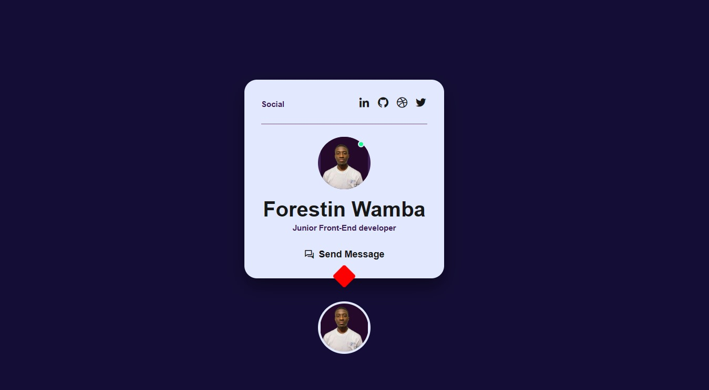

# Professional Profile 

This project is a professional profile card that showcases your information and prfeciency. It provides a visually appealing way to present your professional details to others and a way for others to contact you or visit some of your websites.

## Live Demo

You can view a live demo of the professional profile card [here](https://example.com).

## Features

- Clean and modern design
- Responsive layout for different screen sizes
- Customizable personal information
- Easy to integrate into existing projects

## Installation

To use the professional profile card in your project, follow these steps:

1. Clone the repository: `git clone https://github.com/your-username/professional-profile-card.git`
2. Open the `index.html` file in your web browser.

## Contributing

Contributions are welcome! If you have any suggestions or improvements, please open an issue or submit a pull request.
